<div align="center">

```
██████╗ ███████╗██████╗
██╔══██╗██╔════╝██╔══██╗
██████╔╝█████╗  ██║  ██║
██╔══██╗██╔══╝  ██║  ██║
██║  ██║███████╗██████╔╝
═╝  ╚═╝╚══════╝╚═════╝
```

`codewave4@github:~$ ./translify --from=fa --to=world 🌐`

 Creator of **Translify** — fast & private web translator
⚡ Building clean tools with vanilla JS — no servers, no trackers
🇮🇷 Persian developer

<p align="center">
  <a href="https://codewave4.github.io/zabanpeik/"></a>
  <a href="https://github.com/codewave4?tab=followers"></a>
  
  
</p>

</div>

---

### 📂 cat about.md

> 🌐 Creator of Translify | ⚡ Vanilla JS enthusiast | 🔒 Privacy-first builder
>
> I build fast, clean web tools that run entirely in the browser.
> My goal: a simpler, more private web — starting with Persian users.

---

### 🛠️ ls tech-stack/

<p align="center">
  
  
  
  
  
  
</p>

---

### 🚀 cat featured-projects.md

<table>
  <tr>
    <td>
      <h3>🌐 <a href="https://github.com/codewave4/zabanpeik">Translify</a></h3>
      Fast, accurate & private web translator for 100+ languages.<br/>
      Dual engine (Google → MyMemory) · speech I/O · history · 3 themes<br/><br/>
      <a href="https://codewave4.github.io/zabanpeik/">🔗 Live Demo</a> ·
       ·
      
    </td>
  </tr>
</table>

<details>
<summary>📊 نمودار ستاره‌های Translify</summary>
<p align="center">
  
</p>
</details>

---

### 🌐 ./translify --say hello

<p align="center">
  
</p>

---

### 🗺️ cat journey.log

<p align="center">
  
</p>

---

### 🔥 python github-stats.py

<p align="center">
  
</p>

---

### 📈 cat activity-graph.md

<p align="center">
  
</p>

---

### 🎧 cat now.md

| 🔨 Building | 📚 Learning | 🎯 Goal |
|:-----------:|:-----------:|:-------:|
| پورتفولیوی شخصی | PWA و Service Worker | وبِ خصوصی برای فارسی‌زبان‌ها |

---

### 🤝 echo "Let's Connect!"

<p align="center">
  <a href="https://github.com/codewave4"></a>
  <a href="https://t.me/DeepRed_Code"></a>
</p>

<p align="center">
  <i>"Code is like humor. When you have to explain it, it's bad." — Cory House</i><br/>
  Made with 💚 by codewave4
</p>
